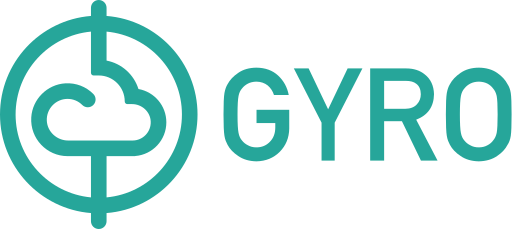

[](https://gitter.im/perfectsense/gyro)
[](https://travis-ci.org/perfectsense/gyro)
[](https://github.com/perfectsense/gyro/blob/master/LICENSE)

Gyro is command-line tool for automating creating, updating, and maintaining cloud infrastructure. Gyro makes infrastructure-as-code possible.

Gyro is open source under the Apache 2.0 license.

Using Gyro allows you to describe your infrastructure using the Gyro language and then create, update, and maintain that infrastructure using the gyro command-line tool.

The Gyro language is designed specifically for defining cloud infrastructure. It was built with readability and organizational flexbility in mind. The language provides the ability to concisely define cloud infrastructure resources along with language constructs such a `@for` loops, `@if` conditionals, and `@virtual` definitions for packaging resources into reusable components.

Here is a sample configuration to create a single instance in AWS:

```
ami-id: $(external-query aws::ami {
    name: 'ubuntu/images/hvm-ssd/ubuntu-xenial-16.04-amd64-server-20190628',
    architecture: 'x86_64',
    root-device-type: 'ebs',
    virtualization-type: 'hvm',
    owner-id: '099720109477',
    state: 'available'
}).0.id

aws::instance webserver
    ami: $(ami-id)
    instance-type: "t3.nano"

    tags: {
        Name: "webserver"
    }
end
```

Run this with gyro:

```
$ gyro up --verbose
↓ Loading plugin: gyro:gyro-aws-provider:0.99.0-SNAPSHOT

Looking for changes...

+ Create aws::instance webserver
· ami: aws::ami id=ami-0cfee17793b08a293
· instance-type: 't3.nano'

Are you sure you want to change resources? (y/N) y

+ Creating aws::instance webserver OK
```

## Getting Started

[Install](https://gyro.dev/guides/getting-started/installing.html#installing-gyro) Gyro.

See [Getting Started](https://gyro.dev/guides/getting-started/index.html) if you're new to Gyro. This is a quick tutorial that will teach you the basics of Gyro.

After the Getting Started tutorial there are plenty of examples for each provider:

- [AWS](https://github.com/perfectsense/gyro-aws-provider/tree/master/examples)
- [Azure](https://github.com/perfectsense/gyro-azure-provider/tree/master/examples)
- [Pingdom](https://github.com/perfectsense/gyro-pingdom-provider/tree/master/examples)

Join the [community](https://gyro.dev/guides/contribute/#chat) and [contribute](https://gyro.dev/guides/contribute/#contribute) to Gyro!

## Developing

Gyro is written in Java using Gradle as the build tool. 

We recommend installing [AdoptOpenJDK](https://adoptopenjdk.net/) if you're going to contribute to Gyro or one of its cloud
provider implementations.

The Gyro project is broken into several subprojects:

- **cli** - The Gyro CLI executable JAR. After building Gyro you'll find the executable binary in ``cli/dist/`` as well as the packaged Java runtime distribution.

- **core** - The core Gyro runtime. The bulk of Gyro lives in the package. Specifically, this package contains the diff engine, workflow implementation, virtual resource implementation, @if and @for implementation, and more.

- **lang** - The Gyro language AST.

- **parser** - The Gyro language parser. We use ANTLR4.

- **util** - Various util classes. 

### Building Gyro

Gyro uses the Gradle build tool. Once you have a JDK installed building is easy, just run `./gradlew` at the root of the Gyro project. This wrapper script will automatically download and install Gradle for you, then build Gyro.

```shell
$ ./gradlew
Downloading https://services.gradle.org/distributions/gradle-5.2.1-all.zip
..............................................................................................................................

Welcome to Gradle 5.2.1!

Here are the highlights of this release:
 - Define sets of dependencies that work together with Java Platform plugin
 - New C++ plugins with dependency management built-in
 - New C++ project types for gradle init
 - Service injection into plugins and project extensions

For more details see https://docs.gradle.org/5.2.1/release-notes.html

Starting a Gradle Daemon, 1 stopped Daemon could not be reused, use --status for details

.
.
.

BUILD SUCCESSFUL in 17s
38 actionable tasks: 28 executed, 10 from cache
$
```

## License

Gyro is open source under the [Apache License 2.0](https://github.com/perfectsense/gyro/blob/master/LICENSE).
