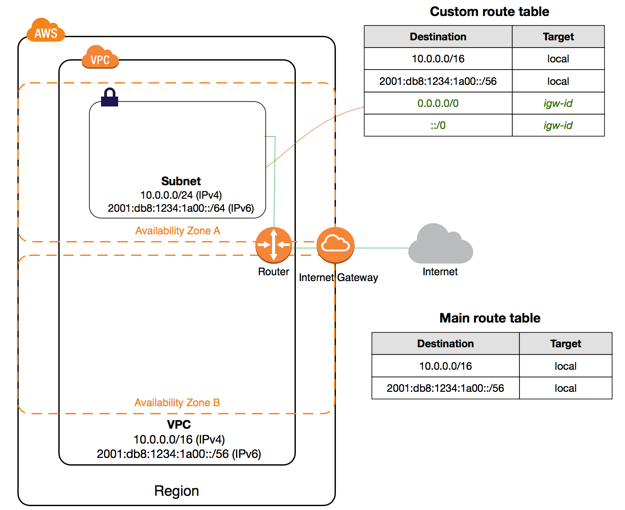
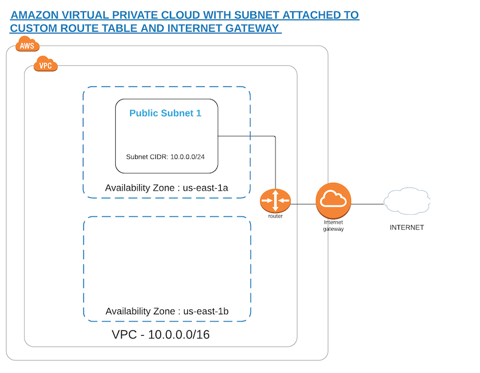

.. title:: Gyro User Guide

Gyro User Guide
===============

Introduction
------------

Gyro is a command-line tool for automating creating, updating, and maintaining cloud infrastructure. Gyro makes
infrastructure-as-code possible.

Using Gyro allows you to model your infrastructure using the Gyro language and then create, update, and
maintain that infrastructure using the ``gyro`` command-line tool.

The Gyro language is a DSL (domain specific language) for defining cloud infrastructure in a human-readable format. It
was built with readability and organizational flexbility in mind. The language provides the ability to concisely define
cloud infrastructure resources along with language constructs such a ``for`` loops, ``if`` conditionals, and
``virtual-resource`` definitions for packaging resources into reusable components.

Why Use Gyro?
+++++++++++++

Gyro is ideal for anyone looking to automate managing infrastructure in a cloud provider such as AWS, or Azure. Here
are several areas Gyro can help:

**Cloud Operations Teams**

Gyro can help teams develop processes for infrastructure changes. Traditionally cloud infrastructure changes
were accomplished using cloud vendor web interfaces which make it difficult verify and track changes. Using
Gyro's DSL to define infrastructure as code teams can manage infrastructure changes using more formal processes
of review. Infrastructure changes can be reviewed to ensure only the requested changes are being made. Changes can
be tracked using any version control sytem.

**Self Service**

Gyro can help organizations implement self service infrastructure. Traditionally cloud infrastructure creation has to
go through a central operations team. As a company grows the ability for an operations team keep pace with these
requests can be difficult or require growing the operations team. Using Gyro common infrastructure can be defined and
shared across an organization allow teams outside the operations team to build and maintain their own infrastructure.

.. raw:: pdf

    PageBreak

Installing Gyro
---------------

Official distributions of Gyro are available for macOS, and Linux operating systems. Official distributions
include a stripped-down OpenJDK 11 so it is not necessary to download and install Java.

Official distributions are:

================== =================
OS                  Archive
================== =================
**macOS**          `gyro-cli-osx-0.15-20190827.211110-49.zip <https://artifactory.psdops.com/gyro-snapshots/gyro/gyro-cli-osx/0.15-SNAPSHOT/gyro-cli-osx-0.15-20190827.211110-49.zip>`_
**Linux**          `gyro-cli-linux-0.15-20190827.211008-49.zip <https://artifactory.psdops.com/gyro-snapshots/gyro/gyro-cli-linux/0.15-SNAPSHOT/gyro-cli-linux-0.15-20190827.211008-49.zip>`_
================== =================

macOS and Linux
+++++++++++++++

Download the distribution and extract it into ``/usr/local/bin``. For example:

.. code:: shell

    $ unzip -d /usr/local/bin gyro-cli-osx-0.15-20190827.211110-49.zip

     Archive:  gyro-cli-osx-0.15-20190827.211110-49.zip
      creating: /usr/local/bin/gyro-rt/
      creating: /usr/local/bin/gyro-rt/bin/
      inflating: /usr/local/bin/gyro-rt/bin/java
      inflating: /usr/local/bin/gyro-rt/bin/jrunscript
      inflating: /usr/local/bin/gyro-rt/bin/keytool
      creating: /usr/local/bin/gyro-rt/conf/
      inflating: /usr/local/bin/gyro-rt/conf/logging.properties
      .
      .
      .
      inflating: /usr/local/bin/gyro-rt/release
      inflating: /usr/local/bin/gyro
    $

Test Your Installation
++++++++++++++++++++++

Check that Gyro is installed and working by creating a small test configuration and running Gyro in test mode. 

Start by creating a gyro directory in your project folder and an initial configuration file named ``init.gyro``, which gets created by running the following command:

 ``gyro init gyro:gyro-aws-provider:0.15-SNAPSHOT``

This will create a .gyro directory with an ``init.gyro`` file and will install all the plugins that are required to spin up a resource.

.. code::

    @repository: 'https://artifactory.psdops.com/public'
    @repository: 'https://artifactory.psdops.com/gyro-snapshots'
    @plugin: 'gyro:gyro-aws-provider:0.15-SNAPSHOT'
    
We will be creating a VPC resource to test our installation.

Create a file named `test.gyro` in the `gyro` directory, with the following configs

.. code::

    aws::vpc vpc
      cidr-block: "10.0.1.0/16"
  
      tags: {
          Name: "vpc-example"
      }
    end

To verify the installation run ``gyro up <file>`` in test mode. If ``y`` is given at the prompt, gyro will generate a state file in the local directory ``.gyro/state/``, you can check your state file here ``.gyro/state/test.gyro``.

.. code:: shell

    $ /usr/local/bin/gyro up --test test.gyro
    ↓ Loading plugin: gyro:gyro-aws-provider:0.15-SNAPSHOT

     Looking for changes...
     
     + Create aws::vpc vpc
     
     Are you sure you want to change resources? (y/N) y

     + Creating aws::vpc vpc OK
    $

.. raw:: pdf

    PageBreak

Common Concepts
---------------

Gyro aims to strike a balance between being a static configuration language and a full programming
language. This section covers both the language features for defining configuration as well as the
concepts necessary to inject logic into your infrastructure configuration.

Resources
+++++++++

A resource is the primary type in Gyro. Everything in Gyro built around defining resources. Each
resource maps to a resource in your cloud provider.

A resource is a group of key/value pairs and subresources. Resources can have one or more key/value
pairs and zero or more subresources.

The syntax of a resource is:

.. code::

    <RESOURCE TYPE> <RESOURCE NAME>
        <KEY>: <VALUE>

        <SUBRESOURCE>
            <KEY>: <VALUE>
        end
    end

- *RESOURCE TYPE* is the name of the resource as provided by a provider plugin (e.g. ``aws::instance``).
- *RESOURCE NAME* is a name you give this instance of the resource. This name is used by Gyro to
  track state of the resource. It's also used when referencing a resource in your own Gyro code.
- *KEY/VALUES* map the settings for a particular resource. For more information on what valid keys
  and values are see the "Key/Values" section below.
- *SUBRESOURCE* are resources tied directly to their parent resource. These resources typically
  cannot live on their own.

Putting this into practice, here is a real-word example of defining a resource:

.. code::

    aws::security-group mysql
        group-name: "database"
        vpc-id: "vpc-0042a33a8ee979101"
        description: "Allow web traffic only"

        ingress
            description: "allow inbound mysql traffic, ipv4 only"
            cidr-blocks: ["10.0.0.0/16"]
            protocol: "TCP"
            from-port: 3306
            to-port: 3306
        end
    end

This example defines a security group in AWS named "db-group" in the vpc with an id of ``vpc-0042a33a8ee979101``. Additionally it defines a single
``ingress`` subresource that opens port 3306 to TCP traffic coming from any IP in the cidr block ``10.0.0.0/16``.

Variables
+++++++++

Variables in Gyro defined using the ``key: value`` syntax and can be defined directly within a file. Variables
define in a file are scoped to that file.

To define a variable that is scoped to all files in a Gyro project, define the variable ``.gyro/init.gyro``. Variables
defined in Gyro files will override variables defined in ``.gyro/init.gyro``.

Variables are referenced using the ``$name`` or ``$(name)`` syntax. Use ``$(name)`` to surround a variable name
when used inside a string.

**Example:**

.. code::

    project: "gyro"
    server-size: "t2.micro"

    aws::instance webserver
        image-id: "ami-0cd3dfa4e37921605"
        instance-type: $server-size

        tags: {
            Name: "$(gyro)-$(server-size)"
        }
    end

Keys must be a valid identifer, or string literal. Identifiers can be made up of letters, digits, ``_``, or ``-``. Spaces
can be included in keys by quoting the key using single quotes (``'``).

Values can by one of the following types:

**Scalar Types**

Gyro has the following scalar types: string, numbers, and booleans.

String literals are defined as is zero or more characters enclosed within single quotes (``'my value'``).

String expressions are defined as zero or more characters enclosed within double quotes. String expressions differ from string
literals in that reference expressions will be interpolated prior to using the value (``"my value with $(key)"``).

Numbers can be integers or floats (``10``, ``10.5``, ``-10``).

Booleans are defined as ``true`` or ``false``.

**Compound Types**

Gyro has two compound types: maps, and lists.

Maps are zero or more comma-separated key/value pairs inside curly brackets (``{ key: 'value' }``).

Lists are zero or more comma-separated values inside square brackets (``['item1', 'item2']``).

Virtual Resources
+++++++++++++++++

Conditionals
++++++++++++

.. raw:: pdf

    PageBreak

Creating Infrastructure
-----------------------

The diagram below depicts the reference architecture of a virtual private network with associated resources.

This document will focus on the implementation of this architecture in AWS.

By the end of this guide you should have a working local Gyro environment and deployed below given resources on AWS cloud :

1. Virtual private cloud network (VPC)
2. Subnet
3. Route Table
4. Internet gateway

Configuration
+++++++++++++

The first step to creating infrastructure with gyro is to define the init config file which has details about your project such as plugins, credentials, global variables and backend file systems.

Inside your project folder, start by creating a `gyro` directory and run the ``gyro init <plugins>`` to create the init file with the required plugins. You can also run ``gyro help init`` for detailed usage of this command.

You also need to add the project specific details in the  ``init.gyro`` configuration file such as credentials which will allow gyro to create resources on cloud.

.. code:: shell

    $ /usr/local/bin/gyro init gyro:gyro-aws-provider:0.15-SNAPSHOT

    + Creating a new .gyro directory
    + Writing to the .gyro/init.gyro file

After generating th init.gyro config file, create a resource file named vpc.gyro with the following configuration :

.. code::

    aws::vpc vpc-example
        cidr-block: "10.0.0.0/16"
    
        tags: {
            Name: "vpc-example"
        }
    end

    aws::subnet subnet-public-us-east-2a
        vpc: $(aws::vpc vpc-example)
        cidr-block: "10.0.0.0/26"
        availability-zone: "us-east-2a"
    
        tags: {
            Name: "subnet-public-us-east-2a"
        }
    end

VPC
+++

aws::vpc - The name of the resource which will be used by gyro to identify the VPC resource.

cidr-block - The IPv4 network range for the VPC, in CIDR notation

Subnet
++++++

aws::subnet - The name of the resource which will be used by gyro to identify the subnet resource.

vpc-id : The ID of the VPC to create the subnet in, which in this case would be the vpc-example.

cidr-block : The IPv4 network range for the subnet, in CIDR notation.

availability-zone : The name of the availablity zone to create this subnet.

The above given configuration would be creating a VPC resource and a subnet associated to that network as depicted in the diagram below :

.. image:: ../images/vpc-subnet-overview.png

Launching Infrastructure
------------------------

Now that the infrastructure configuration is defined, it is ready to launch. Run gyro up ``vpc.gyro``, you can also pass ``--verbose`` flag to get additional details of the resource. When ``y`` is given at the prompt, resource state file gets generated under here ``.gyro/state/vpc.gyro``.

You should see output similar to the following :

.. code:: shell

  $ /usr/local/bin/gyro up vpc.gyro

   ↓ Loading plugin: gyro:gyro-aws-provider:0.15-SNAPSHOT
   ↓ Loading plugin: gyro:gyro-brightspot-plugin:0.15-SNAPSHOT
   ⟳ Refreshed resources: 0
   
   Looking for changes...
   
   + Create aws::vpc vpc-example
   + Create aws::subnet subnet-public-us-east-2a
   
   Are you sure you want to change resources? (y/N) y
   
   + Creating aws::vpc vpc-example OK
   + Creating aws::subnet subnet-public-us-east-2a OK

.. raw:: pdf

    PageBreak

Updating Infrastructure
-----------------------

This section will explain how Gyro handles changes to the configuration of the infrastructure.

Gyro will output a difference between the current settings provided by the configuration files and the current state of the environment in the cloud. It will always output its proposed actions before executing them.
The user can then confirm to execute or abort.

Configuration
+++++++++++++

Use Case 1: Create a custom route table associated to your VPC which will control the network traffic rules for the subnet.

Use Case 2: Create an internet gateway attached to your VPC and ensure that your subnet's route table has an entry for the internet bound traffic to the internet gateway.

Add the below given configs in the vpc.gyro file inorder to update an existing setup environment.

.. code::

	aws::internet-gateway ig-example
	    vpc-id: $(aws::vpc vpc-example | vpc-id)
	end

	aws::route-table route-table-example
	    vpc-id: $(aws::vpc vpc-example | vpc-id)
	    subnet-ids: $(aws::subnet subnet-public-us-east-1a | subnet-id)
	end

	aws::route route-example
	    route-table-id: $(aws::route-table route-table-example | route-table-id)
	    destination-cidr-block: "0.0.0.0/0"
	    gateway-id: $(aws::internet-gateway ig-example | internet-gateway-id)
	    cidr-block: "10.0.0.0/16"
	end

Internet Gateway
++++++++++++++++

aws::internet-gateway - The name of the resource which will be used by gyro to identify the internet gateway.

vpc-id: This is the ID of the VPC to create an internet gateway in

Route Table
+++++++++++

aws::route-table - The name of the resource which will be used by gyro to identify the custom route table.

vpc-id: This is the ID of the VPC to create a route table for.

subnet-ids: Subnet IDs to associate with this route table, it can be a list of subnet ids. In our case there is just one subnet id.

Route
+++++

aws::route - The name of the route resource. This resource will set the route for the internet-bound traffic of the subnet.

route-table-id - This is the ID of the route table to add this route to.

gateway-id - This is the ID of the internet gateway resource which is needed to add a route that directs internet-bound traffic to the internet gateway

cidr-block - This is the destination IPv4 CIDR block to scope the route to a narrower range of IP's.

This will create a custom route table with the below given entries :

================== =================
Destination             Target
================== =================
**10.0.0.0/16**        local
**0.0.0.0/0**          igw-id
================== =================

Gyro will give a difference of variables that have changed for this file, in our case you will see the creates.

Apply the configuration changes by running gyro up again. Gyro will show you what actions are required.

.. code:: shell

  $ /usr/local/bin/gyro up vpc.gyro

   ↓ Loading plugin: gyro:gyro-aws-provider:0.15-SNAPSHOT
   ↓ Loading plugin: gyro:gyro-brightspot-plugin:0.15-SNAPSHOT
   ⟳ Refreshed resources: 2
 
   Looking for changes...
 
   + Create aws::internet-gateway ig-example
   + Create aws::route-table route-table-example
   + Create aws::route route-example
 
   Are you sure you want to change resources? (y/N) y
 
   + Creating aws::internet-gateway ig-example OK
   + Creating aws::route-table route-table-example OK
   + Creating aws::route route-example OK

At this point the network environment displayed in the overview diagram is set up.

.. raw:: pdf

    PageBreak

Destroying Infrastructure
-------------------------

After creating temporary resources for testing or performing other activities, it may be necessary to destroy infrastructure.
Gyro will never destroy infrastructure without prompting.

Delete actions completely remove resources from the cloud.

In order to remove a resource from the existing infrastructure, remove the configs from the resource file.

.. code::

   aws::route route-example
    route-table: $(aws::route-table route-table-example)
    destination-cidr-block: "0.0.0.0/0"
    gateway: $(aws::internet-gateway ig-example)
  end

Removing the route resource will delete the internet-bound traffic route from the route table.

.. code:: shell

  $ /usr/local/bin/gyro up vpc.gyro

   ↓ Loading plugin: gyro:gyro-aws-provider:0.15-SNAPSHOT
   ↓ Loading plugin: gyro:gyro-brightspot-plugin:0.15-SNAPSHOT
   ⟳ Refreshed resources: 5

   Looking for changes...

   - Delete aws::route route-example

   Are you sure you want to change resources? (y/N) y

   - Deleting aws::route route-example OK

Gyro confirms the deletion. Typing y will execute the delete request. All resource deletions work the same way in gyro: remove the resource section from the config file.

In order to remove the entire virtual private cloud network instead of associated resources, remove the entire VPC config section from vpc.gyro file.
Gyro will start deleting the parent resource along with the associated resources.

Example given below : remove this entire section from the vpc.gyro file :

.. code::

   aws::vpc vpc-example
       cidr-block: "10.0.0.0/16"
   
       tags: {
           Name: "vpc-example-1"
       }
   end

   aws::subnet subnet-public-us-east-2a
       vpc: $(aws::vpc vpc-example)
       cidr-block: "10.0.0.0/26"
       availability-zone: "us-east-2a"
   
       tags: {
           Name: "subnet-public-us-east-2a"
       }
   end
   
   aws::internet-gateway ig-example
       vpc: $(aws::vpc vpc-example)
   
       tags: {
           Name: "ig-example"
       }
   end
   
   aws::route-table route-table-example
       vpc: $(aws::vpc vpc-example)
       subnets: [$(aws::subnet subnet-public-us-east-2a)]
   
       tags: {
           Name: "route-table-example"
       }
   end

The resource vpc and associated resources will get deleted after ``y`` is given at the prompt.

.. code:: shell

   $/usr/local/bin/gyro up vpc.gyro

    ↓ Loading plugin: gyro:gyro-aws-provider:0.15-SNAPSHOT
    ↓ Loading plugin: gyro:gyro-brightspot-plugin:0.15-SNAPSHOT

    ⟳ Refreshed resources: 4

    Looking for changes...

    - Delete aws::vpc vpc-example (vpc-0db28818a6cb91795)
    - Delete aws::subnet subnet-public-us-east-2a (subnet-00ef07cf7a507d64c)
    - Delete aws::internet-gateway ig-example (igw-04463fa091c36aff6)
    - Delete aws::route-table route-table-example (rtb-09c6c85e550100385)

    Are you sure you want to change resources? (y/N) y

    - Deleting aws::route-table route-table-example (rtb-09c6c85e550100385) OK
    - Deleting aws::internet-gateway ig-example (igw-04463fa091c36aff6) OK
    - Deleting aws::subnet subnet-public-us-east-2a (subnet-00ef07cf7a507d64c) OK
    - Deleting aws::vpc vpc-example (vpc-0db28818a6cb91795) OK

.. raw:: pdf

    PageBreak